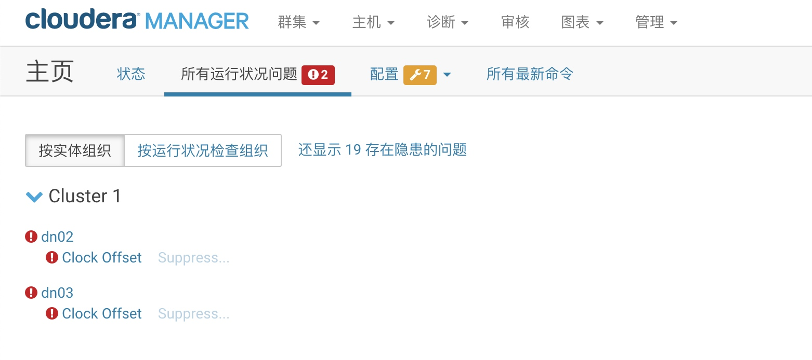
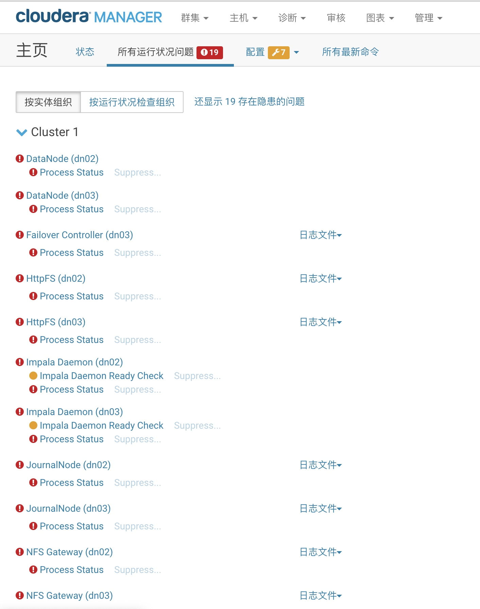
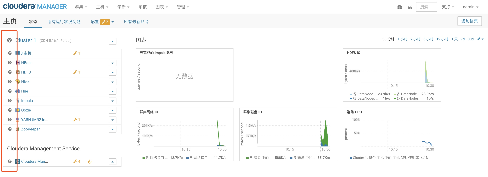
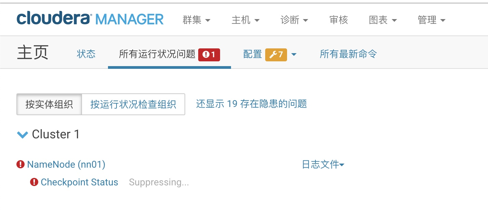

# Hadoop时间同步测试报告

## 结论

对于 改变Hadoop集群时间对历史数据影响 的测试已经完成，结论如下：

- 1. **除了影响监控信息以外，基本不会影响历史数据，可以正常存取。**
- 2. **将要调整的时间和现在的时间，不要相差4小时以上，否则会影响到 HDFS 的 checkpoint 机制。**
- 3. **额外建议：由于生产环境远比测试环境复杂的多，所以建议停止服务后做时间同步，当时间同步成功过后，再重启服务检查服务状态。**

## 环境

- 测试范围：HDFS 和 HBase
- 测试环境：10.0.3.62 - 10.0.3.64
- 测试版本：Cloudera Express 5.16.1 
- 测试方法：在集群启动的时候，通过手动对集群中的不同机器的时间进行修改（向前/向后），检验 HDFS 和 HBASE 是否可以正常写入和读取数据

## 警告

> **测试过程中的一些警告**

- 1. Clock Offset 警告

> 当集群各服务器时间不一致时，会报 Clock Offset 警告，不会影响存取，当集群各服务器时间同步之后，该警告会自动消失。

- 2. Process Status 警告

> 当集群各服务器时间不一致 或者 同步后的时间和原时间差很多时，会报 Process Status 警告，含义是 “不良 : 该角色的主机与 Cloudera Manager 断开联系的时间过长”，不会影响存取，注意：该警告不会自动消失（或者是还没测出来多久会消失，等过10分钟左右），重启整个集群，可以解决该警告。

- 3. 运维监控服务失效

> 有时会出现 Cloudera Management Service 不工作问题，不会影响存取，单个重启 Cloudera Management Service 即可，重启后其他组件如果满足 Process Status 条件，会报 Process Status 警告。

- 4. 检查点异常

> 最后一次我停服务，然后将当前时间 2020-07-10 11:30:00 修改至 2020-07-09 10:00:00 时，报出的警告，含义是有太多 checkpoint ，该警告不会影响存取，**但无法通过操作或者重启解决该警告。**最后通过将时间调回至 2020-07-10 10:00:00 做左右解决该问题，下文是错误提示信息：
> 
> ERROR：The health test result for NAME_NODE_HA_CHECKPOINT_AGE  has become bad: The filesystem checkpoint is 4 hour(s) old. This is 401.25% of the configured checkpoint period of 1 hour(s). Critical 　　　　threshold: 400.00%. 2,793 transactions have occurred since the last filesystem checkpoint. This is 0.28% of the configured checkpoint transaction target of 1,000,000.
> 
> 经过对错误信息的理解，现在无法确定现在具体的检查点在那，但是应该大致可以得出：**将要调整的时间和现在的时间最好不好差过4个小时以上，否则会影响到 HDFS 的 checkpoint 机制。**
> 
> 另外：连续频繁调整时间可能会导致 Cloudera Management Service 无法停止，需要到服务器上直接重启服务 scm 的服务：service cloudera-scm-server restart 和 service cloudera-scm-agent restart

- 5. NN节点被选为备选节点

> NN节点作二级时间服务器，当无法和一级时间服务器互通时，会被投成备选NN节点，导致程序无法访问NN节点，**通过停止现有活动节点NN服务，HA最自动将切换备选节点为活动节点，可以解决该问题。**。

**综上，由于生产环境远比测试环境复杂的多，所以建议停止服务后做时间同步，当时间同步成功过后，再重启服务检查服务状态。**