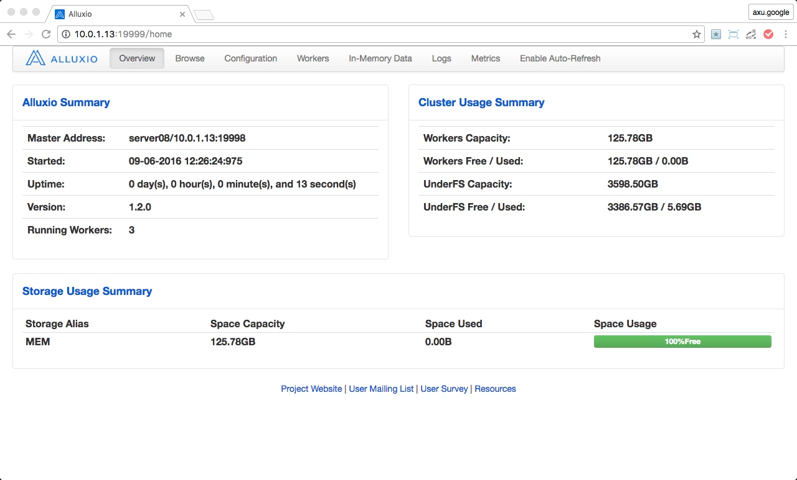
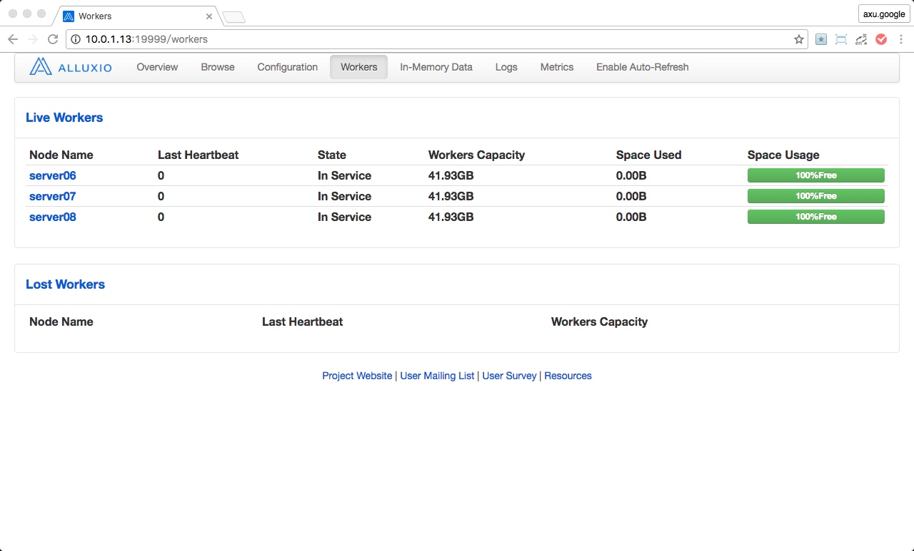

# ALLUXIO 集群模式

## 目录

[TOC]

## Alluxio 集群模式部署

> **注意:** 
> 本文默认用户已经完成 **单机模式部署** ；若没有完成 **单机模式部署** 请阅读 **ALLUXIO 单机模式**。
> 若已经完成 **单机模式部署** 用户，本文中 `ALLUXIO_WORKER` 使用的安装包和 `ALLUXIO_MASTER` 使用的安装包一样，即将安装包拷贝过去解压即可。

### 部署环境说明

#### 服务器信息说明

角色|`IP`地址|主机名(`HOSTNAME`)
---|---|---
`ALLUXIO_MASTER`|10.0.1.13|server08
`ALLUXIO_WORKER`|10.0.1.11|server06
`ALLUXIO_WORKER`|10.0.1.12|server07
`ALLUXIO_WORKER`|10.0.1.13|server08
`HDFS_NAMENODE`|10.0.1.8|server03

#### 版本信息说明

名称|版本
---|---
`CentOS`|`6.4`
`CDH`|`5.6.0`
`HADOOP`|`2.6.0`
`ALLUXIO`|`1.2.0`

<!-- more -->

### 部署步骤

> **注意:** 若没有完成 **单机模式部署** ，请先参照 **ALLUXIO 单机模式** 文档完成 **单机模式部署**。
> 若已完成 **单机模式部署** 请登陆到`ALLUXIO_MASTER`服务器，执行如下命令，停止**ALLUXIO**服务。
 
```bash
cd /opt/alluxio-1.2.0
bin/alluxio-stop.sh all
```

> **注意:** 在停止命令执行过程中，需要输入服务器密码，是因为在 **单机模式部署** 没有建立信任关系的原因，如果已建立信任关系则不会提示需要输入服务器密码。
 
```bash
> bin/alluxio-stop.sh all
Killed 1 processes on server08
Killed 1 processes on server08
Waiting for WORKERS tasks to finish...
root@localhost's password: 
All WORKERS tasks finished, please analyze the log at /opt/alluxio-1.2.0/logs/task.log.
```

#### 设置主机名

> **注意:** 因为在 **单机模式部署** 中已经设置过 `ALLUXIO_MASTER` 和 `HDFS_NAMENODE` 的主机名称，所以本次只需要设置额外的 `ALLUXIO_WORKER` 主机名即可。

##### 检查现在已设置的主机名

```bash
> cat /etc/hosts
[...]
10.0.1.13 server08
10.0.1.8 server03
``` 

##### 设置额外的 `ALLUXIO_WORKER` 主机名到 `/etc/hosts` 文件

```bash
echo "10.0.1.11 server06" >> /etc/hosts
echo "10.0.1.12 server07" >> /etc/hosts 
```

##### 检查

```bash
> cat /etc/hosts
[...]
10.0.1.13 server08
10.0.1.8 server03
10.0.1.11 server06
10.0.1.12 server07
``` 

##### 同步`/etc/hosts`文件内容到所有的`ALLUXIO_WORKER`服务器上

> **注意:** 若你的`ALLUXIO_WORKER`服务器不是新的服务器，服务器的`/etc/hosts`文件中，已存在设置过的主机名，则你不要按照下文命令同步，因为会完全覆盖原来的`/etc/hosts`文件（你之前已经你设置的那些主机名就没有了）。你需要手动将上面的内容添加至你的`ALLUXIO_WORKER`服务器的`/etc/hosts`文件中。

```bash
scp /etc/hosts root@server06:/etc/
scp /etc/hosts root@server07:/etc/
```

#### 建立信任关系

> **注意:** 本文中建立信任关系使用的是脚本 `pushssh.sh` 完成。
> 本文会提供该脚本的下载和使用方式，但是不保证该脚本在你的操作系统可以执行成功（本人使用的是`CentOS 6.4`，如果你也是和本人使用同样操作系统和版本应该没有问题）。
> 若你有别的方式可以建立信任关系则可以不用阅读 `pushssh.sh` 脚本的下载和使用。
> 若没有方式建立信任关系而且`pushssh.sh`脚本又不成功的同学，可以自行根据你的操作系统和版本通过搜索引擎查找建立信任关系的方法。（网上有很多教程）

##### 获取建立信任关系脚本（`pushssh.sh`）

> **注意:** 获取脚本需要使用`git`命令，所以需要安装`git`

```bash
yum -y install git
```

**检查安装结果**

```bash
> git --version
git version 1.7.1
```

**通过`github`获取脚本**

```bash
cd /opt/
git clone https://github.com/axu4github/scripts.git
```

**检查已获取的脚本**

```bash
> cat scripts/pushssh.sh
#!/bin/bash

if [ ! $1 ]; then
  echo "usage: pushssh.sh user@remoteserver "
  exit
fi

PORT=22

[...]

cat ~/.ssh/id_rsa.pub | ssh $1 -p $PORT "cat - >> .ssh/authorized_keys"

if [ $? -eq 0 ]; then
 echo "Success"
fi
```

##### 使用脚本创建信任关系

> **注意:** 执行 `pushssh.sh` 脚本后会提示创建或者输入密码等信息，只需要根据它的提示提供相应的信息即可。
> 
> 提示信息有两种：
> 1. 目标服务器从来没有和别的服务器创建过信任关系（没有`/root/.ssh`目录）
> 2. 目标服务器已经和别的服务器创建过信任关系（存在`/root/.ssh`目录）
> 
> 下文分别展示这两种服务器使用 `pushssh.sh` 脚本建议信任关系时，提示的信息。
> `server06` 为情况1（没有和别的服务器建立过信息关系）
> `server07` 为情况2（已经和别的服务器建过信任关系）

**情况1（没有和别的服务器建立过信息关系）**

```bash
> /opt/scripts/pushssh.sh root@server06
root@server06 22
Generating public/private rsa key pair.
# 此处是需要输入保存密钥地址，一般直接'回车'（使用默认设置）
Enter file in which to save the key (/root/.ssh/id_rsa):
# 此处是需要输入信任关系中公钥和私钥的密码，一般直接'回车'（不需要密码）
Enter passphrase (empty for no passphrase): 
# 此处是再次需要输入信任关系中公钥和私钥的密码，一般直接'回车'（不需要密码）
Enter same passphrase again: 
Your identification has been saved in /root/.ssh/id_rsa.
Your public key has been saved in /root/.ssh/id_rsa.pub.
The key fingerprint is:
f7:2b:c3:ed:e3:ac:a0:2f:a8:df:98:72:49:b9:44:27 root@server08
The key's randomart image is:
+--[ RSA 2048]----+
|                 |
|                 |
|                 |
|    E .          |
|   . +  S .      |
|    +    . .     |
|   o +  .. ..    |
|  . =+.. .+.o.   |
|  .=+ oo. .*=.   |
+-----------------+
The authenticity of host 'server06 (10.0.1.11)' can't be established.
RSA key fingerprint is 16:6b:4b:f7:39:93:d9:2b:11:79:67:8b:d6:48:d0:88.
# 需要输入'yes'
Are you sure you want to continue connecting (yes/no)? yes
Warning: Permanently added 'server06,10.0.1.11' (RSA) to the list of known hosts.
# 需要输入`server06`的密码
root@server06's password: 
mkdir: cannot create directory `/root/.ssh': File exists
# 需要再次输入`server06`的密码
root@server06's password: 
Success
```

**情况2（已经和别的服务器建过信任关系）**

```bash
> /opt/scripts/pushssh.sh root@server07
root@server07 22
The authenticity of host 'server07 (10.0.1.12)' can't be established.
RSA key fingerprint is 29:8a:ee:6b:a5:a8:b2:92:9b:94:8c:31:13:2e:cb:7c.
# 需要输入'yes'
Are you sure you want to continue connecting (yes/no)? yes
Warning: Permanently added 'server07,10.0.1.12' (RSA) to the list of known hosts.
# 需要输入`server07`的密码
root@server07's password:  
mkdir: cannot create directory `/root/.ssh': File exists
# 需要再次输入`server07`的密码
root@server07's password: 
Success
```

**开始分别给目标服务器创建信任关系**

```bash
/opt/scripts/pushssh.sh root@server06
/opt/scripts/pushssh.sh root@server07
/opt/scripts/pushssh.sh root@server08
```

#### 拷贝安装包到`ALLUXIO_WORKER`节点

分别将安装包`alluxio-1.2.0-cdh5-bin.tar.gz`，拷贝到`ALLUXIO_WORKER`节点上。

```bash
scp /opt/alluxio-1.2.0-cdh5-bin.tar.gz server06:/opt/
scp /opt/alluxio-1.2.0-cdh5-bin.tar.gz server07:/opt/
scp /opt/alluxio-1.2.0-cdh5-bin.tar.gz server08:/opt/
```

> **注意:** 若信任关系建立成功，则拷贝时时不需要输入密码的。

#### 解压`ALLUXIO_WORKER`节点安装包

**分别登陆** 到`server06`和`server07`服务器，执行解压命令

```bash
cd /opt
tar -zxvf alluxio-1.2.0-cdh5-bin.tar.gz
chown -R root:root alluxio-1.2.0
```

> **注意:** 是要分别登陆到两个服务器，保证`server06`和`server07`服务器上`/opt/`目录下都有解压完成的`alluxio-1.2.0`目录

#### `ALLUXIO_MASTER`配置`ALLUXIO_WORKER`节点

登陆`ALLUXIO_MASTER`服务器（`server08`）修改`/opt/alluxio-1.2.0/conf/workers`文件

> **注意:** 需要登陆到`server08`服务器上执行

```bash
cd /opt/alluxio-1.2.0
vim conf/workers
``` 

将`ALLUXIO_WORKER`服务器主机名全部添加进去（一行一个）

**未修改时`/opt/alluxio-1.2.0/conf/workers`内容**

```bash
> cat conf/workers
#
# The Alluxio Open Foundation licenses this work under the Apache License, version 2.0
# (the "License"). You may not use this work except in compliance with the License, which is
# available at www.apache.org/licenses/LICENSE-2.0
#
# This software is distributed on an "AS IS" basis, WITHOUT WARRANTIES OR CONDITIONS OF ANY KIND,
# either express or implied, as more fully set forth in the License.
#
# See the NOTICE file distributed with this work for information regarding copyright ownership.
#

# An Alluxio Worker will be started on each of the machines listed below.
localhost
```

**修改后`/opt/alluxio-1.2.0/conf/workers`内容**

```bash
> cat conf/workers
#
# The Alluxio Open Foundation licenses this work under the Apache License, version 2.0
# (the "License"). You may not use this work except in compliance with the License, which is
# available at www.apache.org/licenses/LICENSE-2.0
#
# This software is distributed on an "AS IS" basis, WITHOUT WARRANTIES OR CONDITIONS OF ANY KIND,
# either express or implied, as more fully set forth in the License.
#
# See the NOTICE file distributed with this work for information regarding copyright ownership.
#

# An Alluxio Worker will be started on each of the machines listed below.
server06
server07
server08
```

#### 同步配置文件到`ALLUXIO_WORKER`节点

登陆`ALLUXIO_MASTER`服务器（`server08`）

> **注意:** 需要登陆到`server08`服务器上执行
 
```bash
cd /opt/alluxio-1.2.0
bin/alluxio copyDir conf 
```

**查看执行结果**

```bash
> bin/alluxio copyDir conf
RSYNC'ing /opt/alluxio-1.2.0/conf to workers...
server06
server07
server08
```

> **注意:** 该命令会将`ALLUXIO_MASTER`服务器的`/opt/alluxio-1.2.0/conf`目录和其中文件，分别同步到`/opt/alluxio-1.2.0/conf/workers`文件制定的`ALLUXIO_WORKER`服务器中的`/opt/alluxio-1.2.0/`目录下，如果该目录下没有`conf`目录则创建。

#### 启动服务

登陆`ALLUXIO_MASTER`服务器（`server08`）

> **注意:** 需要登陆到`server08`服务器上执行

```bash
cd /opt/alluxio-1.2.0
bin/alluxio-start.sh all
```

##### 发现`bug`

启动后发现只有`ALLUXIO_MASTER`启动成功，`ALLUXIO_WORKER`都没有启动成功。
之后根据启动提示的日志文件`/opt/alluxio-1.2.0/logs/task.log`追踪问题。
发现提示在日志文件`/opt/alluxio-1.2.0/logs/task.log`中，提示`"Pseudo-terminal will not be allocated because stdin is not a terminal."` 错误。

```bash
> cat /opt/alluxio-1.2.0/logs/task.log
2016-09-05 16:04:41,008
   INFO MASTER  Connecting to localhost as root...
Pseudo-terminal will not be allocated because stdin is not a terminal.^M
Warning: Permanently added 'localhost' (RSA) to the list of known hosts.^M
Formatting Alluxio Worker @ server08
2016-09-05 16:05:41,234
   INFO WORKERS  Connecting to localhost as root...
Pseudo-terminal will not be allocated because stdin is not a terminal.^M
2016-09-06 11:46:11,114
   INFO WORKERS  Connecting to server06 as root...
2016-09-06 11:46:11,118
   INFO WORKERS  Connecting to server07 as root...
2016-09-06 11:46:11,122
   INFO WORKERS  Connecting to server08 as root...
Pseudo-terminal will not be allocated because stdin is not a terminal.^M
Pseudo-terminal will not be allocated because stdin is not a terminal.^M
Pseudo-terminal will not be allocated because stdin is not a terminal.^M

[...] 
```

##### 解决`bug`

解决该问题，需要修改`/opt/alluxio-1.2.0/bin/alluxio-workers.sh`文件，具体修改内容如下:
将文件中的 `"nohup ssh -o ConnectTimeout=5 -o StrictHostKeyChecking=no -t ${worker} ${LAUNCHER} \"`行代码中的 "`-t`" 替换为 "`-tt`"。

> **注意:** 下文是执行`git diff`命令对比 `修改后文件` 和 `修改前文件`。 

```bash
> cd /opt/alluxio-1.2.0/bin
> git diff alluxio-workers.sh alluxio-workers.sh.raw

diff --git a/alluxio-workers.sh b/alluxio-workers.sh.raw
index 6741c3c..96ca7a6 100755
--- a/alluxio-workers.sh
+++ b/alluxio-workers.sh.raw
@@ -38,13 +38,10 @@ else
   WORKER_ACTION_TYPE="MASTER"
 fi
 
-# - 将 ssh -t 改为 ssh -tt
-# - 应对"Pseudo-terminal will not be allocated because stdin is not a terminal"错误
-# - 可以使用"cd /opt/alluxio-1.2.0/bin; vimdiff alluxio-workers.sh alluxio-workers.sh.raw"查看改动
 for worker in $(echo ${HOSTLIST}); do
   echo "$(date +"%F %H:%M:%S,$(date +"%s%N" | cut -c 11- | cut -c 1-3)")
    INFO ${WORKER_ACTION_TYPE}  Connecting to ${worker} as ${USER}..." >> ${ALLUXIO_TASK_LOG}
-  nohup ssh -o ConnectTimeout=5 -o StrictHostKeyChecking=no -tt ${worker} ${LAUNCHER} \
+  nohup ssh -o ConnectTimeout=5 -o StrictHostKeyChecking=no -t ${worker} ${LAUNCHER} \
    $"${@// /\\ }" >> ${ALLUXIO_TASK_LOG} 2>&1&
 done
```

> **注意:** 该`bug`已经提交给`alluxio team` [BUG#3891](https://github.com/Alluxio/alluxio/issues/3891)，若`alluxio team`在之后版本解决则无需更改文件。

##### 同步文件

登陆`ALLUXIO_MASTER`服务器（`server08`）

> **注意:** 需要登陆到`server08`服务器上执行

```bash
/opt/alluxio-1.2.0
bin/alluxio copyDir bin/alluxio-workers.sh
```

##### 重启服务

登陆`ALLUXIO_MASTER`服务器（`server08`）

> **注意:** 需要登陆到`server08`服务器上执行

**停止服务**

```bash
cd /opt/alluxio-1.2.0
bin/alluxio-stop.sh all
```

**启动服务**

```bash
cd /opt/alluxio-1.2.0
bin/alluxio-start.sh all
```

#### 通过`web-ui`查看启动状态

启动成功后，可以在浏览器中访问 (http://server08:19999) 查看服务内容





#### 执行测试用例

```bash
> bin/alluxio runTests
[...]
runTest Basic NO_CACHE ASYNC_THROUGH
2016-09-05 16:16:54,017 INFO  type (BasicOperations.java:writeFile) - writeFile to file /default_tests_files/Basic_NO_CACHE_ASYNC_THROUGH took 9 ms.
2016-09-05 16:16:54,025 INFO  type (BasicOperations.java:readFile) - readFile file /default_tests_files/Basic_NO_CACHE_ASYNC_THROUGH took 8 ms.
Passed the test!
runTest BasicNonByteBuffer NO_CACHE ASYNC_THROUGH
Passed the test!
```

`- EOF -` 


