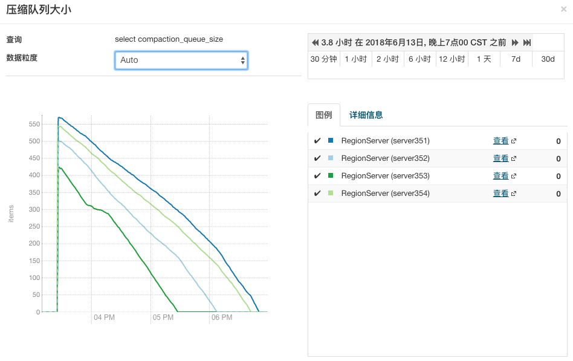
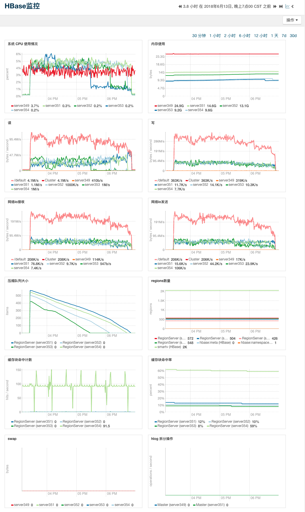

# HBase Majorcompaction 测试报告

## 概述

由于 HBase 自动执行 Majorcompaction 我们无法控制操作时间和资源消耗。所以在 生产环境 已经停止 HBase 自动执行 Majorcompaction 。本次测试的主要目的就是： **要了解针对 HBase 表手动执行 Majorcompaction 对集群和服务器资源的影响，以便可以根据影响大小评估执行时间和执行频率。**

## 环境信息

### 集群环境

#### 服务器资源信息


#### 服务器角色信息


### HBase测试表信息

> **注意：在往测试表灌数据之前就已经将自动执行 Majorcompaction 配置取消，同时设置 HFile 大小为 512 MB。**

- 测试表名：smartv
- 测试表数据条数：136999999
- 测试表数据量大小：1.1 T（在HDFS中，实际存储3.3TB）
- 测试表region数量：2048
- 测试表HFile个数：4140（由于没做过压缩，所以 **数据量大小 != 单个HFile大小 x HFile个数**）

```bash
# 查看现有表数据条数（如果数据量过大不建议使用，本次统计 136999999 条数据用了约 3 - 4个小时）
> hbase org.apache.hadoop.hbase.mapreduce.RowCounter "smartv"
[...]
18/06/13 11:59:56 INFO mapred.JobClient: Job complete: job_local1068608155_0001
18/06/13 11:59:57 INFO mapred.JobClient: Counters: 19
18/06/13 11:59:57 INFO mapred.JobClient:   File System Counters
18/06/13 11:59:57 INFO mapred.JobClient:     FILE: Number of bytes read=64271033583
18/06/13 11:59:57 INFO mapred.JobClient:     FILE: Number of bytes written=52348672000
18/06/13 11:59:57 INFO mapred.JobClient:     FILE: Number of read operations=0
18/06/13 11:59:57 INFO mapred.JobClient:     FILE: Number of large read operations=0
18/06/13 11:59:57 INFO mapred.JobClient:     FILE: Number of write operations=0
18/06/13 11:59:57 INFO mapred.JobClient:     HDFS: Number of bytes read=0
18/06/13 11:59:57 INFO mapred.JobClient:     HDFS: Number of bytes written=0
18/06/13 11:59:57 INFO mapred.JobClient:     HDFS: Number of read operations=0
18/06/13 11:59:57 INFO mapred.JobClient:     HDFS: Number of large read operations=0
18/06/13 11:59:57 INFO mapred.JobClient:     HDFS: Number of write operations=0
18/06/13 11:59:57 INFO mapred.JobClient:   Map-Reduce Framework
18/06/13 11:59:57 INFO mapred.JobClient:     Map input records=136999999
18/06/13 11:59:57 INFO mapred.JobClient:     Map output records=0
18/06/13 11:59:57 INFO mapred.JobClient:     Input split bytes=286158
18/06/13 11:59:57 INFO mapred.JobClient:     Spilled Records=0
18/06/13 11:59:57 INFO mapred.JobClient:     CPU time spent (ms)=0
18/06/13 11:59:57 INFO mapred.JobClient:     Physical memory (bytes) snapshot=0
18/06/13 11:59:57 INFO mapred.JobClient:     Virtual memory (bytes) snapshot=0
18/06/13 11:59:57 INFO mapred.JobClient:     Total committed heap usage (bytes)=531502202880
18/06/13 11:59:57 INFO mapred.JobClient:   org.apache.hadoop.hbase.mapreduce.RowCounter$RowCounterMapper$Counters
18/06/13 11:59:57 INFO mapred.JobClient:     ROWS=136999999

# 查看现有表数据大小
> hdfs dfs -du -s -h /hbase/data/default/smartv
1.1 T  3.3 T  /hbase/data/default/smartv

# 查看现有表 region 数量（实际数量应该是 Found - 2 ，因为有2个系统文件）
> hdfs dfs -ls /hbase/data/default/smartv | more
Found 2050 items
[...]

# 查看 HFile 个数
> hdfs dfs -ls -h /hbase/data/default/smartv/*/cf/* | wc -l
4140
```

## 执行命令

```bash
# 执行发起 HBase Majorcompaction 命令
> echo "major_compact 'smartv'" | hbase shell
[...]
```

> **注意：该命令只是发起 HBase Majorcompaction 操作的命令，所以会很快执行完成。**

## 过程监控

因为启动执行 HBase Majorcompaction 操作后，HBase 会创建很多的 任务 到 压缩队列 中。所以可以根据 压缩队列大小 的变化去确定 HBase Majorcompaction 执行是否完成。



## 执行结果

**本次测试表大小为 1.1TB 执行时间约 3.5 小时。**

### 资源使用总览

我们对 **CPU**，**内存**，**磁盘I/O**，**网络I/O**，**压缩队列大小** 以及 **region数量** 等指标进行监控。

监控结果如下图：



### 执行后HBase测试表信息

- 测试表名：smartv（不变）
- 测试表数据量大小：1.1 T（不变）
- 测试表region数量：2048（不变）
- 测试表HFile个数：**2048（压缩后HFile数量因数据合并而减少，最后完成每个HFile约512MB）**

```bash
# 查看现有表数据大小
> hdfs dfs -du -s -h /hbase/data/default/smartv
1.1 T  3.3 T  /hbase/data/default/smartv

# 查看现有表 region 数量（实际数量应该是 Found - 2 ，因为有2个系统文件）
> hdfs dfs -ls /hbase/data/default/smartv | more
Found 2050 items
[...]

# 查看 HFile 个数
> hdfs dfs -ls -h /hbase/data/default/smartv/*/cf/* | wc -l
2048
```

## 总结

通过执行结果可以得到如下结论：

1. HBase Majorcompaction 主要会涉及服务器的 **CPU**，**磁盘I/O** 和 **网络I/O**。
2. 在整个过程中 **CPU** 的使用率为 **2% - 6% 之间**，对 **CPU** 不会产生太多影响。
3. HBase Majorcompaction 主要会消耗服务器的 **磁盘I/O** 和 **网络I/O**。
4. **磁盘I/O** 读写量有很大差别，原因是要写 **3份** 数据。
5. 从 **写效率** 和 **持续时间** 看，应该是重新写了一遍 **全部数据**。
6. 执行瓶颈和压力在 **磁盘I/O** 部分，因为 **网络I/O** 没有吃满。
7. 在生产环境上执行 HBase Majorcompaction 时，需要找到一个 **服务器 磁盘I/O 不高的时间** 执行，如果全部表都执行预计需要 **1天** 时间。
